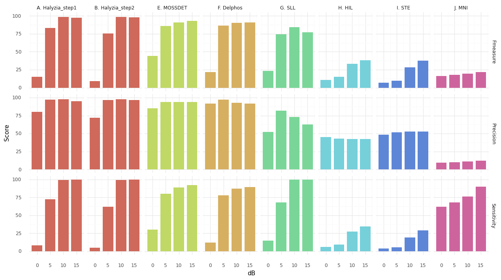

# Halyzia© / Ladybird performance in detecting pathological epileptic events and resistance to false positives

## Description
This program demonstrates results of the processing performed by Ladybird / Halyzia©, a software for the automatic detection of fast-ripples (FRs) in epilepsy [[L. Gardy, doctoral thesis](https://data.inpi.fr/brevets/FR3128111)], [[Brevet: FR3128111](http://thesesups.ups-tlse.fr/5164/1/2021TOU30190.pdf)].

More specifically, this notebook presents the performance of Halyzia in the detection of Fast Ripples (FR) at different signal to noise ratios: 0dB, 5 dB, 10 dB and 15 dB. Step 1 of Halyzia consists of detecting pathological shapes on EEG scalograms transformed into images with a convolutional neural network (CNN). Halyzia's Step 2 filters false positives using a homemade algorithm consisting of multiple clustering and probabilistic steps.

## Installation

### Prerequisites

- Python 3.11
- Python libraries: see requirements.txt

## Usage
Detailed analysis here can be accessed and performed from [main.ipynb](https://github.com/LudovicGardy/halyzia_performance_steps/main.ipynb).

### Input data
 The data used for this work are the gold standard of the literature [1], used by several authors to evaluate their Fast Ripples, Ripples or Intercritical Epileptic Spikes detector. These simulated EEG data are composed of 40,320 events that can appear alone or in combination, as show in the table below.

## Results
| Event type      | 0 dB | 5dB     | 10dB     | 15dB     | **TOTAL**     |
| :---        |    :----:   |    :----:     |    :----:     |    :----:     |    :----:     |
| FR alone      | n=1140 | n=1140     | n=1140     | n=1140     | **n=5,760**     |
| FR + Ripple      | n=1140 | n=1140     | n=1140     | n=1140     | **n=5,760**     |
| FR + Spike      | n=1140 | n=1140     | n=1140     | n=1140     | **n=5,760**     |
| FR + Spike + Ripple      | n=1140 | n=1140     | n=1140     | n=1140     | **n=5,760**     |
| Spike + Ripple      | n=1140 | n=1140     | n=1140     | n=1140     | **n=5,760**     |
| Spike alone      | n=1140 | n=1140     | n=1140     | n=1140     | **n=5,760**     |
| Ripple alone      | n=1140 | n=1140     | n=1140     | n=1140     | **n=5,760**     |
| **TOTAL**      | **n=10,080** | **n=10,080**     | **n=10,080**     | **n=10,080**     | **n=40,320**

### Detector evaluation methods
- Events that contain an FR and are detected by the algorithm are considered true positives (TP). 
- Events that do not contain an FR and are detected by the algorithm are considered false positives (FP). 
- Events that contain an FR and are not detected by the algorithm are considered false negatives (FN). 
- Events that do not contain FR and are not detected by the algorithm are considered true negatives (TN). 

### Metrics
- **Sensitivity (sens)** was calculated as follows:  
  \[
  \text{sens} = \frac{\text{TP}}{\text{TP} + \text{FN}}
  \]

- **Precision (prec)** was calculated as follows:  
  \[
  \text{prec} = \frac{\text{TP}}{\text{TP} + \text{FP}}
  \]

- **F measure** was calculated as follows:  
  \[
  F_1 = 2 \times \frac{\text{prec} \times \text{sens}}{\text{prec} + \text{sens}}
  \]

### Summary figure
We compared the performance of Halyzia with other detectors evaluated on the same dataset (see [1]).

## References
[1] Roehri, N., Pizzo, F., Bartolomei, F., Wendling, F., & Bénar, C. G. (2017a). What are the assets and weaknesses of HFO detectors? A benchmark framework based on realistic simulations. PLoS ONE, 12(4). https://doi.org/10.1371/journal.pone.0174702

## Author
- LinkedIn: [Ludovic Gardy](https://www.linkedin.com/in/ludovic-gardy/)
- Doctoral thesis: [PDF](http://thesesups.ups-tlse.fr/5164/1/2021TOU30190.pdf)